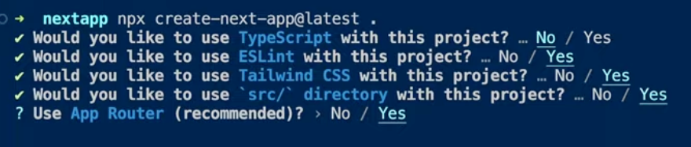

# 1. 설치와 실행

- `npx create-next-app .`
  현재폴더에서 nextjs 실행환경 셋팅. `.`은 현재폴더에 설치하는 것을 의미.

- 13버전부터 App라우터 도입하므로 사용. 이전에는 page라우터였음.

- `npm run start` 가 아니라 `npm run dev` 로 `nextjs` 실행
  `start`는 react app에서 사용하는 것이기 때문에 다르다.
