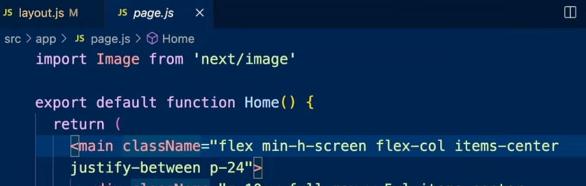
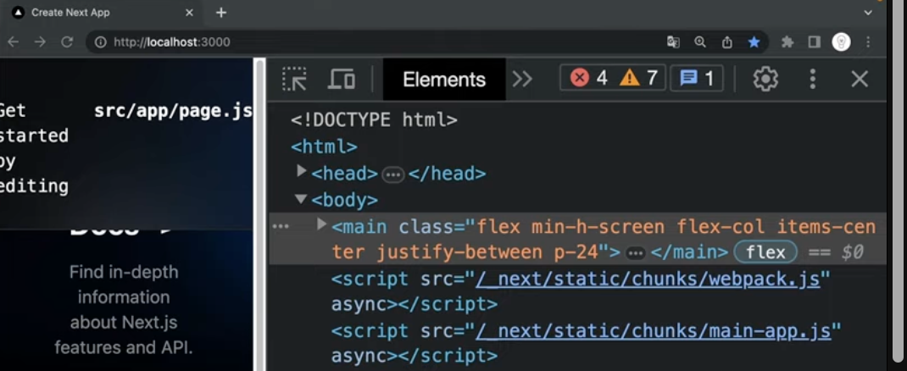

# 샘플앱 세탁

### layout.js


```js
import "./globals.css";
export const metadata = {
  title: "Create Next App",
  description: "Generated by create next app",
};
export default function RootLayout({ children }) {
  return (
    <html>
      <body>{children}</body>
    </html>
  );
}
```

레이아웃은 모든 페이지가 공유하는 HTML 코드가 담겨 있다.

> `src/app/layout.js` 는 앱의 골격을 의미.
> 크롬기준 `개발자도구-요소` 열면 구성되어 있는 html과 body는 layout.js 에 들어 있음.

### page.js



개발자도구의 body 안 main 태그는 개발자도구에서 봤을 때 복잡한 className을 가지고 있음.
이 main태그는 `layout.js`의 body 태그 안 `{children}`에 해당되는데, `{children}` 은 `src/app/page.js` 가 리턴한 값임.

### global.css

layout.js 에 import되어 있는 globals.css 파일 때문에 배경색 등이 검정색인 것. globals.css 파일만 남겨두고 내부 코드 삭제.

> 마지막으로, 모든 사이트에 적용된 디자인이 src/app/global.css에 담겨 있다.
> 이것은 마치 책의 디자인과 같은 것.
> 이 파일의 모든 내용을 지워서, 우리만의 디자인을 적용해봅시다!

이제, Nextjs 앱의 세탁이 완료
