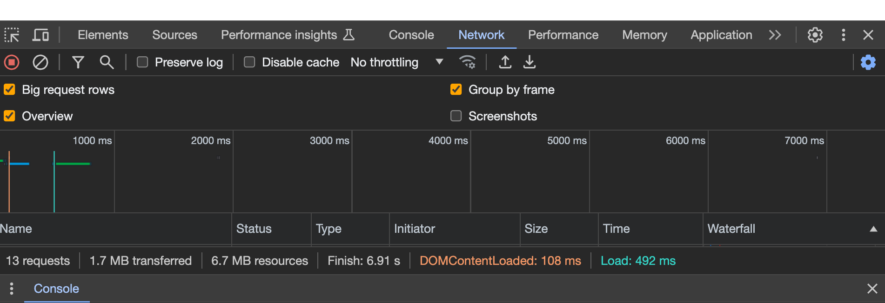
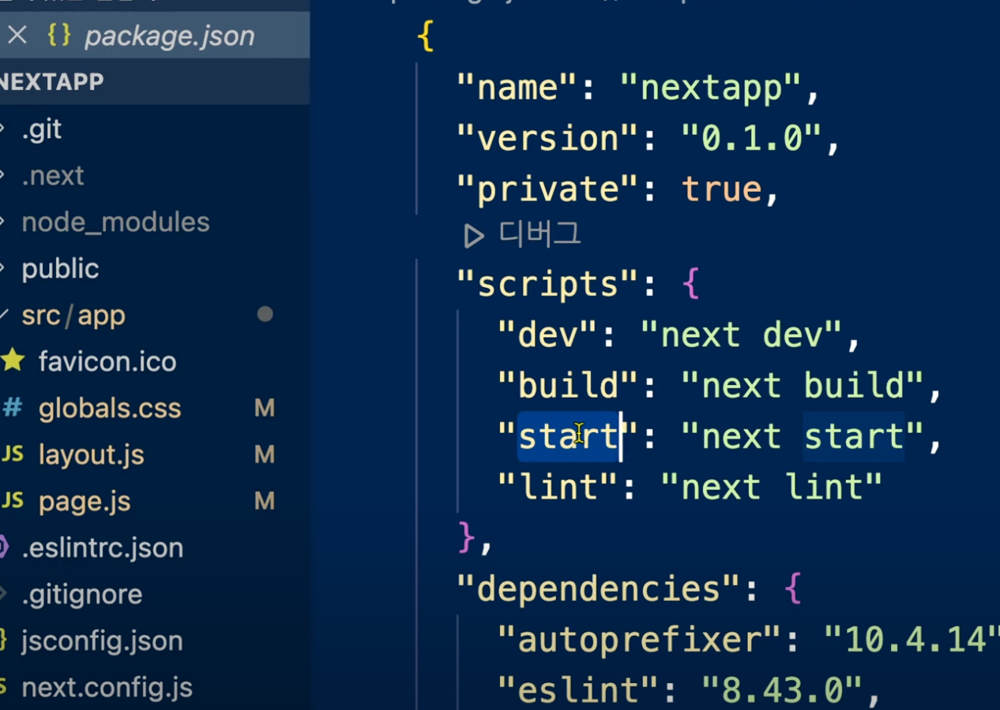
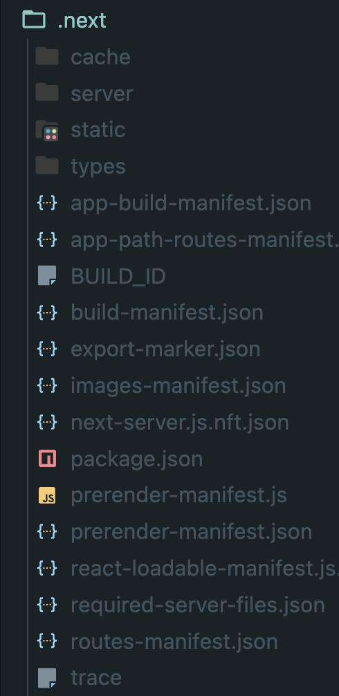
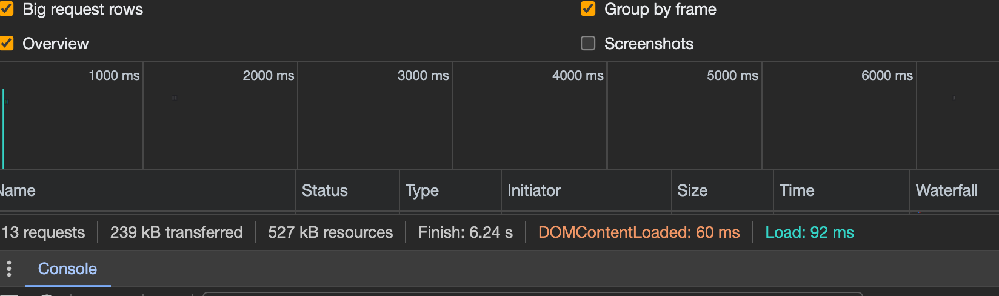

# 배포

크롬 개발자도구-네트워크 에서 새로고침을 해보면 하단에 `6.7MB resources` 라고 나옴. 서버에서 클라이언트로 전송한 용량이 *6.7MB*나 된다는 것을 의미. 큰 용량은 비효율적이고 보안에 문제가 될 수 있다.
그렇기 때문에 용량을 더 줄이고 불필요한 메세지를 출력하지 않은 실서버에 최적화된 버전이 필요한 것이다.

Node js 기반으로 만들어진 프로젝트들은 `package.json` 파일에서 `script` 안에 프로젝트를 유지보수하기 위한 명령어들이 있음.
`build` 는 실서버를 위한 배포판을 만드는 명령. `start` 는 배포판을 서비스하기 위한 명령.

> 실행중인 화면 끄기( `npm run dev` 한 것을 종료)는 `control+C`키(맥북도 동일) 로 종료.

.next 폴더는 개발을 하건 , 빌드를 하건 사용자들에게 서비스되는 내용이 저장되는 폴더.

터미널에 `npm run build` -> `npm run start` 하고 다시 localhost:3000 새로고침하면 개발자도구-네트워크 탭 아래에 `527kB resources` 로 용량이 크게 줄어있는 것을 확인할 수 있음.
