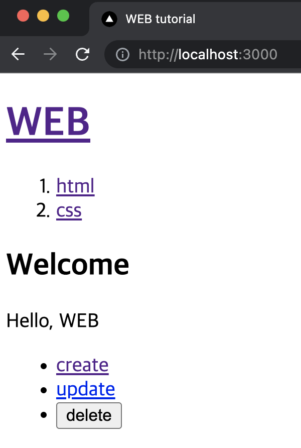
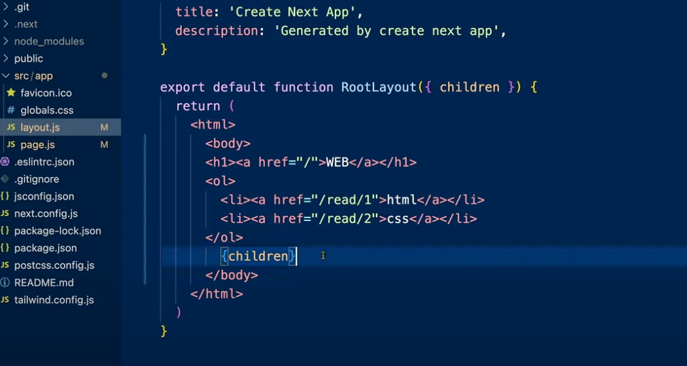

# 뼈대 만들기



처음 보여지는 화면은 src/app/page.js,
content 바깥쪽에 공통된 내용은 layout.js 로 관리하는 것이 더 편리하다.( head, footer, nav ... )

#### children



`page` 에서 만든 것들은 `layout` 에 **children** 으로 오게 된다.

#### metadata

layout.js 혹은 page.js에서 metadat를 export하면 html의 head 안에 내용을 생성할 수 있다.

app/layout.js 중 일부

```js
export const metadata = {
  title: "WEB tutorial",
  description: "Generated by egoing",
};
```
