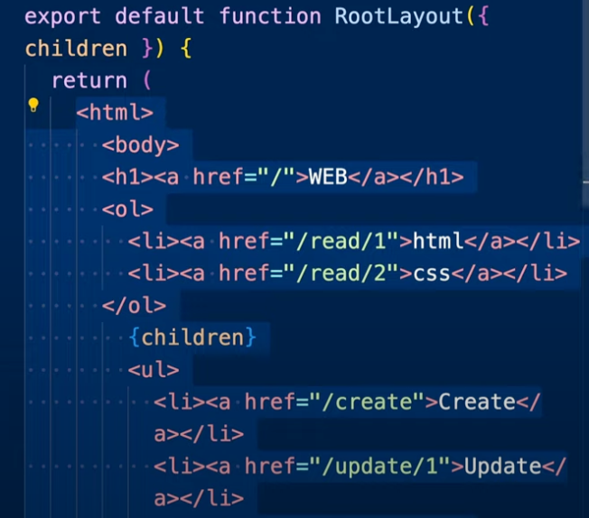

# 라우팅 - Next.js의 도로교통 시스템

> 사용자가 접속한 URL의 path에 따라서 콘텐츠를 응답해주는 작업을 '라우팅' 이라고 합니다. 어떤 프레임워크든 그 중심에는 반드시 라우팅이 있습니다. 이것은 웹개발의 가장 중요한 요소 중 하나입니다.


domain: 도메인 네임, 주소
path : 경로 ("/dashboard/analytics/")
segment : 경로를 이루고 있는 각각의 요소("dashboard","analytics")

저 경로에 따라서 어떤 컨텐츠를 어떤 방식으로 보여줄 것 인가를 **라우팅** 이라함

## 절차



1. 처음에 "/create" 로 접속하면 "Not found" 페이지가 출력된다.
2. app 및에 create라는 폴더를 만들고 약속된 이름에 파일(page.js)를 만들고 컴포넌트를 만들게 된다면

```js
export default function Create() {
  return <>Create!!</>;
}
```

3. "/create"로 다시 접속하면 정삭적으로 create 페이지가 출력된다.

### 알 수 있는 것

1. "pages" 아래의 폴더는 세그먼트를 의미합니다. "/create"는 "pages/create" 폴더를 의미
2. "pages/create.js" 파일이 있다면, 이 파일의 반환 값을 화면에 출력
3. **이 값을 상위 컴포넌트인 `_app.js`의 `children` 위치에 표시**
4. 이때, "pages/index.js"는 무시

## layout 중첩하기

app/create/page.js를 감싸는 하위 레이아웃을 만들고 싶다면, 다음과 같은 방법으로 할 수 있다

> app/layout.js 는 page.js 를 감싸고 있는 레이아웃.
> 지금 만드는 건 create 페이지를 감싸는 layout.

1.  app/create/layout.js 만들기

```js
export default function Layout(props) {
  return (
    <form>
      <h2>Create</h2>
      {props.children}
    </form>
  );
}
```

위의 코드는 새로운 페이지를 만들 때 사용하는 템플릿. 'Create'라는 제목 아래에 자식 컴포넌트를 배치하도록 레이아웃을 정의하고 있다.

2. /create로 접속해보기

위의 레이아웃을 적용한 후, 웹 브라우저에서 /create 경로로 이동하면 새로 만든 레이아웃이 적용된 페이지를 볼 수 있음.

#### 결과


### 알 수 있는 것

1. app/create/layout.js가 있다면, 이 파일로 app/create/page.js를 포장한 후에 app/layout.js로 포장합니다. 이는 레이아웃의 중첩을 허용.
2. Next.js는 URL 경로의 세그먼트에 따라 콘텐츠를 찾고, 해당 콘텐츠가 위치한 폴더의 layout.js를 시작으로 상위 폴더를 탐색하면서 layout.js로 감싸줍니다. 이는 Next.js의 라우팅 로직을 잘 나타내는 특징이다.

이런 방식으로 Next.js는 간단하고 직관적인 라우팅을 제공하며, 프로젝트의 복잡성을 효과적으로 관리할 수 있도록 도와줌.

## dynamic routing

`read/1`, `read/2` 의 "1,2"는 가변적으로 변경되는 경로이다. 이런 경로를 처리하려면 어떻게 할까?

먼저 '/read/2'에 접속해보면 "Not Found" 페이지가 당연히 출력된다.


`/app/read/[id]/page.js`를 만들자.
`[id]`는 무엇일까? dynamic 하게 바뀌는 세그먼트에 이름(변수)을 부여하는 것이다.


```js
// Read [id] page.js
export default function Read(props) {
  return (
    <>
      <h2>Read</h2>
      parameter : {props.params.id}
    </>
  );
}
```

이제 다시한번 read 페이지를 방문하게 된다면


화면이 잘 출력되는 것을 볼 수 있다.

> 우리가 id 라고 지정한 숫자들(1,2)은 어떻게 contant로 가져올 수 있을까?
> 우선 props 를 지정해주고, props 의 값을 보면 params 라는 값이 있다.
> params 의 안에 id 값을 보게 되면 우리가 지정한 값들이 들어가는 것을 확인 할 수 있다.
> 이것을 통해 우리는 contant로 그것들을 가져올 수 있게 되었다
