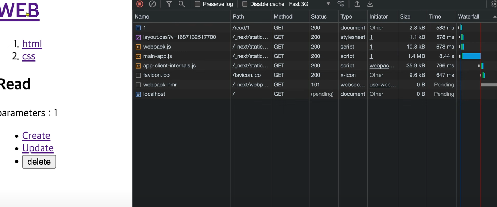
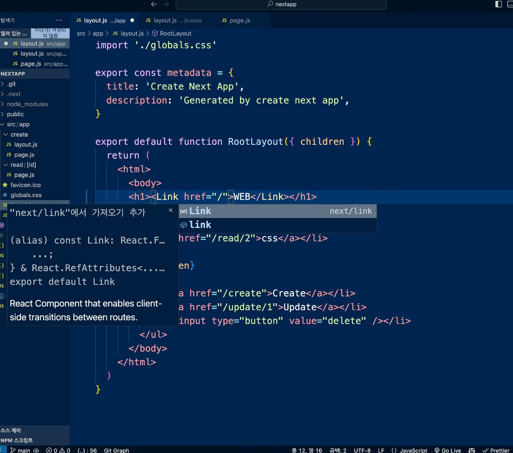
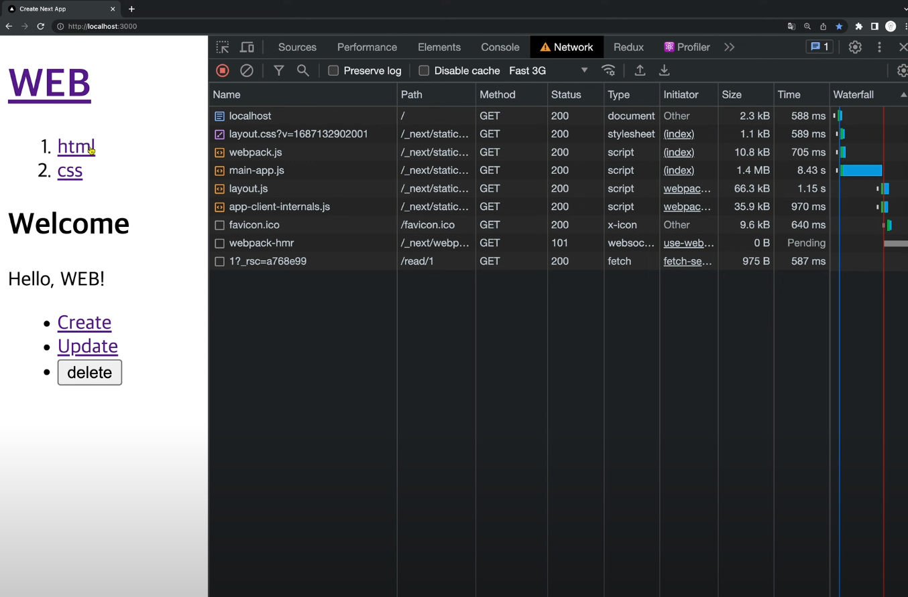

# Single Page Application

### 우리가 하고 싶은 것들

- 링크를 클릭하면 페이지 전체 리로딩이 일어나지 않고 필요한 콘텐츠만 로딩
- 이미 방문한 페이지는 캐슁을 해서 다시 다운로드 하지 않도록 하기
- 미리 페이지를 로드했다가 실제 요청이 있을 때 클라이언트 측에서 즉시 응답

#### Link 적용

1. 브라우저의 개발자도구/Network 탭을 열어보자
2. 링크를 클릭했을 때 서버와 통신하는 양상을 확인해보자
   

- 리액트는 js 기반이기 때문에 js를 끈다면 페이지가 리로드 렌더링이 되지않는다.
  하지만 Nextjs 로 만든 웹페이지는 리로드해도 렌더링이 잘된다.
  ➡️ 이것이 가능한 이유: 사용자가 요청하면 .next 폴더에 nextjs가 서버쪽에서 리액트를 실행해서 그 응답결과를 .next에 저장해서 그것을 응답하는 것.
  (nextjs 는 js가 아닌 다 만들어진 웹을 응답하는 것이다, 검색엔진 최적화)

- 나쁜점: 특정한 페이지를 방문할때마다 컨텐츠 영역이 바뀌는 영역이 부분적이어도 모든 영역을 다시 다운 받게 된다.(사용자 입장: 느리다, 서비스 제공자: 비용증가),
  이미 방문한 적 있는 페이지도 마찬가지로 또 다시 다운로드를 받게 됨
  이런 문제를 극복하기 위해 Link 컴퍼넌트를 적용

3. 모든 a 태그를 Link 컴퍼넌트로 변경
   
4. 다시 링크를 클릭해서 아래와 같은 변화를 확인

- 페이지 리로딩이 없음
- 방문한 페이지를 다운로드 받지 않음
- 미리 페이지를 다운로드

태그를 컴퍼넌트로 변경 후 network 탭을 보게 된다면 아직 링크를 클릭하지 않아도 미리 페이지를 다운로드 받고 있는 것을 확인할 수 있다.
당연히 클릭 하자마자 페이지가 나타난다.
이미 방문했던 페이지를 또 방문하면 서버랑 통신도 하지 않는다.
(사용자 : 빠르다, 제공자: 비용절약)

이렇게 웹페이지가 여러개이지만 한페이지처럼 동작하는걸 SPA 라고 하고 nextjs 를 이용하면 Link 컴퍼넌트 하나로 SPA를 쉽게 경험 할 수 있다.

5. SPA의 의미 생각
   하나의 페이지에서 모든 작업을 처리하는 앱을 의미.
   서버로부터 가져올 데이터가 있다면 'ajax' 와 같은 방법을 통해서 동적으로 로딩
   이것을 **SPA**(Single Page Application)이라고 한다
   `Link` 는 Next.js 에서 SPA를 매우 쉽게 구현하도록 도와주는 도구.

### 정리

#### a태그와 nextjs Link태그 차이점

a태그를 사용해 링크를 연결하면, 해당 링크로 들어갔을 때 바뀌어야 하는 페이지 외의 변화가 없는 layout 같은 다른 부분들도 전부 처음부터 끝까지 요청 보내서 다운로드 받게 된다. (개발자도구-네트워크 탭에서 확인 가능)

a태그를 Link태그로 바꾸고 클릭하면 내가 이동하려는 페이지만 요청이 들어간다. 하지만 이조차도 이미 클릭해서 요청이 들어간 적이 있는 페이지는 다시 다운로드받지 않고 바로바로 페이지가 렌더링된다.

-> Single Page Application이 된다.
