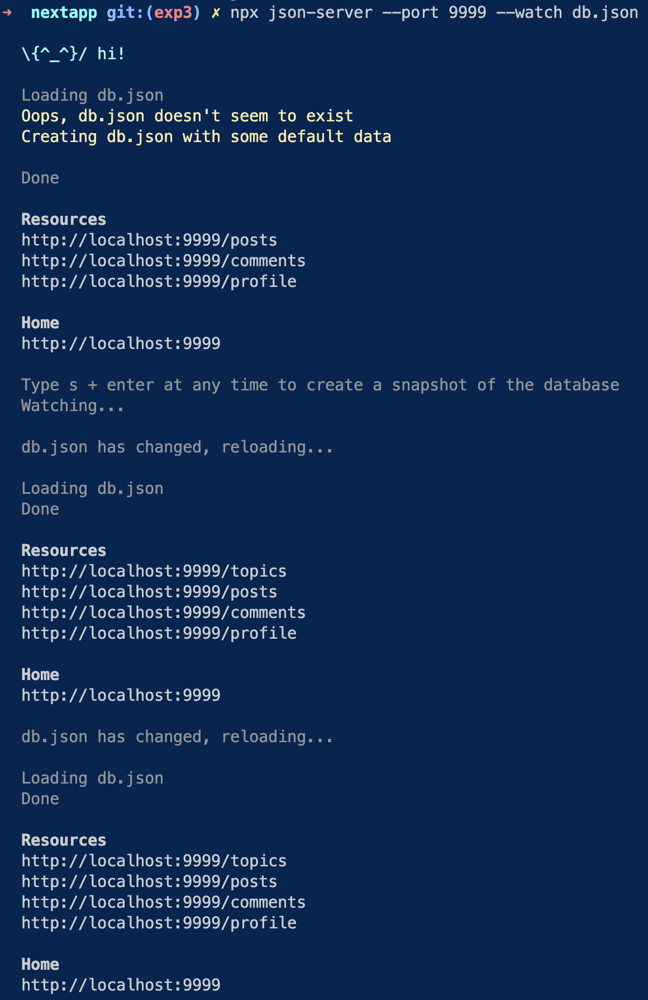

# Backend


Nextjs은 백엔드까지 동시에 제공하는 `Full Stack Framwork`이다.
Route Handlers를 사용하면 별도의 백엔드를 구축하지 않고 Nextjs API 서버까지 구축할 수 있다고 한다.

하지만 여기서는 Json-server를 이용해서 간단하게 백엔드를 구축하고 다뤄본다.

### 절차

```
npx json-server --port 9999 --watch db.json
```

1. json-server 실행
   
   실행하게 된다면 9999 서버로 백엔드가 실행된다.
   db.json 도 생성되게 된다.
   --watch 옵션은 db.json 이 변경된다면 자동으로 적용해주는 명령어
2. db.json 수정

```js
{
  "topics": [
    {
      "id": 1,
      "title": "html",
      "body": "html is .."
    },
    {
      "id": 2,
      "title": "css",
      "body": "css is .."
    }]
}
```

/topics 라는 주소를 접속하게 된다면 글 목록을 보여지게 하고 싶다.
db.json을 수정하게 된다면 변경된 내용이 반영된다. 리로드 하게 된다면 파일에 있는 내용이 json 형태로 응답하는 것을 확인가능


> 저기 있는 데이터를 js 로 받아와보자

3. 개발자 도구 Network 창에서 ESC 키를 눌러서 콘솔창 열기
   fetch 함수를 이용해서 데이터를 받아와보자.

```js
fetch("http://localhost:9999/topics")
  .then((resp) => {
    // 서버가 준 데이터는 json 이니까 json을 js로 컴퍼팅
    return resp.json();
  })
  .then((result) => {
    // 가져온 데이터를 console.log
    console.log("result", result);
  });
```


