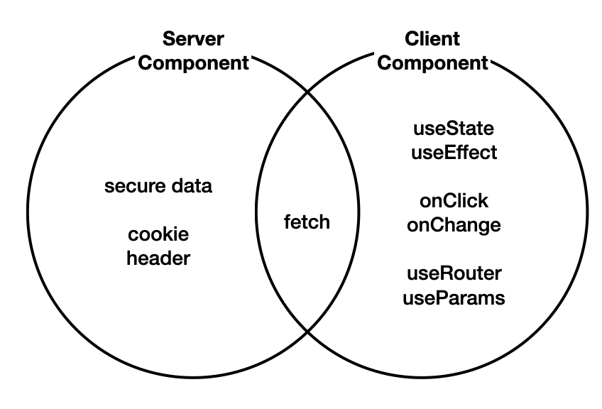
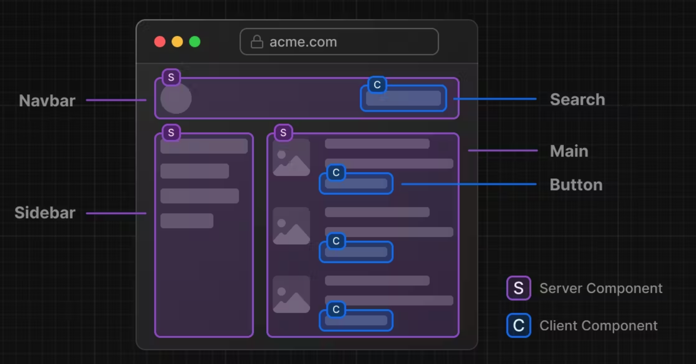
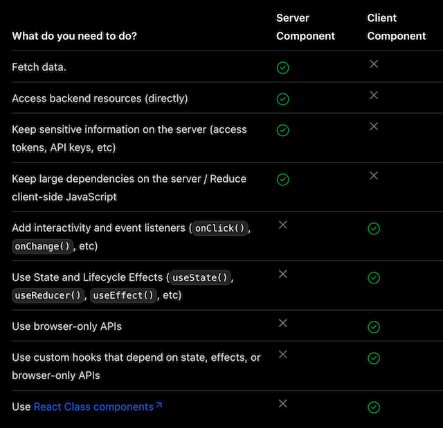
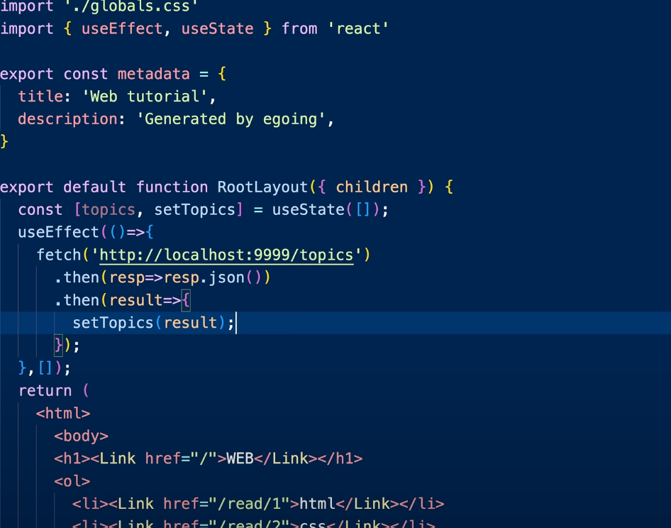
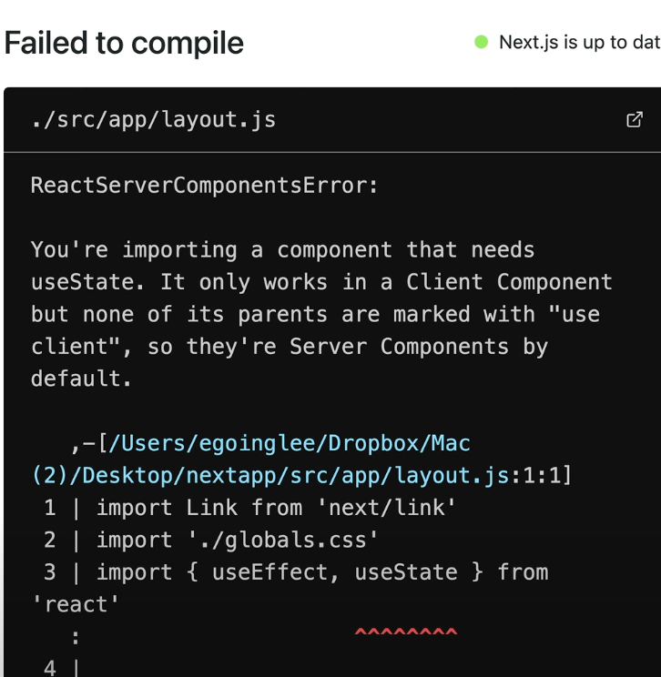

# 글목록 가져오기

nextjs에서 서버쪽의 데이터를 가져와서(fetch) 이를 UI에 반영하는 방법을 살펴보자.



nextjs의 컴포넌트는 크게 Server Component, Client Component로 구분된다.
특별한 처리를 하지 않으면 nextjs에서 컴포넌트는 Server Component 로 분류된다.



위 그림을 보면 S가 Server, C가 Client 의 사용 사례를 보여준다.

**Server Component**

- 사용자와 상호 작용하지 않는 경우
- 백엔드에 엑세스하면서 보안적으로 위험한 정보를 주고 받는 경우

**Client Component**

- 서버 컴포넌트로 해결되지 않는 경우
- 사용자와 상호작용하는 경우
- useEffect, useState, onClick, onChange 와 같은 API를 사용해야하는 경우
- useRouter, useParams와 같은 nextjs의 Client Component API 를 사용하는 경우

> nextjs 구분법
> 

### 절차


먼저 서버에서 데이터를 가져오기 위해서 useEffect를 통해서 가져와서 useState에 데이터를 저장하도록 시도해보자.

그럼 이런 에러가 뜨면서 막히게 된다.
에러를 살펴보면 useState는 오직 Client Component 에서만 동작한다고 한다.
nextjs는 기본적으로 Serever Component로 보기 때문에 서버컴포넌트에서 useState를 사용하려 헀기 때문에 에러가 나온 것.

이 모듈을 클라이언트 컴포넌트로 바꾸고 싶다면 위에 `use Client`를 적어주면 된다고 한다.

그러고 metadata 코드를 주석처리하고 리로드해보면 잘동작하는 것을 볼 수 있다.

이렇게 코드를 짜고 본다면 아쉬운 점을 찾을 수 있다.
useEffect를 이용해서 fetch하고 있는데 만약 서버가 거리가 멀다면 데이터를 가져오는데 시간이 오래 걸릴 것이다. 그렇다면 상당한 비효율이 발생된다.
그리고 현재코드에서 js가 동작하지 않는다면 정적인 내용은 잘 보이지만 서버랑 통신하는 useEffect 등 과 같은 코드는 화면에 표시 되지 않는다.
만약 로그인을 해서 DB에 접속한다면 사용자에게 노출이 되기 때문에 보안적으로도 문제가 될 수 있다.

이제 이 단점들을 해결해보자.

### 절차2

server component에서는 fetch를 사용할 때 useEffect를 사용하지 않고, fetch를 이용할 때 await를 사용해보자. (async도 선언해주자)

> fetch도 비동기적으로 작성하는 것이 아닌 동기적인 코드로 바꾸자.

```js
export default async function RootLayout({ children }) {
  const resp = await fetch('http://localhost:9999/topics/')
  const topics = await resp.json();
```

```js
// 글목록 생성
{
  topics.map((topic) => {
    return (
      <li key={topic.id}>
        <Link href={`/read/${topic.id}`}>{topic.title}</Link>
      </li>
    );
  });
}
```

서버쪽에서 fetch 메서드 실행되고 끝날 때 까지 기다렸다가 json 으로 바꾸라는 명령이 전달되면서 topics데이터를 가지고 와서 그 데이터를 가지고 글 목록을 동적으로 생성하고 그렇게 만들어진 결과를 .next에 나름대로 저장하고 최종적 내용이 Client로 전달 되는 것

이 방법은?
서버 컴포넌트는 모든 작업을 서버 쪽에서 처리하고, 그 결과인 html 코드만 클라이언트로 전송합니다. 이것을 서버쪽에서 랜더링을 한다고해서 **server side rendering**이라고 합니다.

#### 좋은점

- 간결한 코드: useEffect와 useState와 같은 훅을 사용하지 않아도 되므로, 코드가 더 간결하고 이해하기 쉬워집니다. 이로 인해 코드 유지 관리가 쉬워지고, 버그 발생 확률이 줄어들 수 있습니다.
- 빠른 데이터 엑세스: 데이터베이스와 같은 자원에 접근해야 하는 경우, 서버 컴포넌트는 서버와 데이터베이스가 가까운 위치에서 작동하므로, 더 빠른 속도로 필요한 데이터에 접근할 수 있습니다.
- 보안: 서버 컴포넌트는 클라이언트에 민감한 정보(예: 데이터베이스 비밀번호)를 전송하지 않습니다. 이로 인해, 필요한 작업을 안전하게 처리하면서 동시에 클라이언트의 보안을 유지할 수 있습니다.
- 향상된 성능: 서버 컴포넌트는 클라이언트로 JavaScript 코드를 전송하지 않습니다. 이는 전송되는 데이터의 양을 줄이고, 클라이언트의 부하를 줄임으로써 웹사이트의 전반적인 성능을 향상시키는데 도움이 됩니다.

### 정리

단순히 보여주는 것은 Server Component, 사용자와 상호작용하는 것은 Client Component라고 생각하면 된다.

nextjs 는 기본적으로 서버컴포넌트로 간주된다.
서버 컴포넌트에 useState, useEffect와 같은 훅은 사용할 수 없고 Client Component에서만 작동된다.
