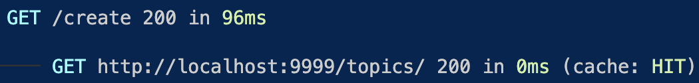

# Cache

router.refresh를 했음에도 글 목록이 갱신되지 않을 것,
그 이유는 서버쪽에서 fetch를 사용하면 응답 결과를 저장하기 때문이다, 개발 서버를 다시 시작하고, 페이지를 리로드한 후에 터미널을 보자.


루트 페이지(/)로 접속했을 때 `app/layout.js`에서 fetch가 동작해서 `http://localhost:3000/api/topics/`로 접속이 발생했다는 뜻.
**cache** : MISS는 캐쉬가 없기 때문에 서버에 실제로 접속해서 데이터를 가져왔다는 뜻

다시 접속하게 된다면

**cache** : HIT 입니다. 캐쉬를 사용했다는 뜻

캐쉬를 삭제한 후에 router.refresh를 하면 된다,
하지만 그건 수업의 범위를 벗어나기 때문에 fetch를 하는 단계에서 캐쉬를 사용하지 않는 방법을 살펴보자

> 자세한 내용은 [revalidate](https://nextjs.org/docs/app/building-your-application/data-fetching/fetching-caching-and-revalidating)를 확인해주세요.

어떻게하면 캐쉬를 우리가 끌 수 있을까? 방법은 여러가지가 있다.

#### revalidate

```js
const res = await fetch("http://localhost:9999/topics", {
  next: { revalidate: 10 },
});
```

fetch 를 할때 revalidate 옵션을 주게 된다면, 10초 동안만 캐쉬를 유지하겠다는 것.
이렇게 하게 된다면 글을 생성하고 페이지를 이동했을 때 바로 캐쉬가 업데이트 되지 않기 때문에 0으로 바꿔주는 게 좋다.

#### cache: no-store

```js
const res = await fetch("http://localhost:9999/topics", {
  cache: "no-store",
});
```

캐쉬 정책을 저장하지 않는다. 라는 옵션.

캐쉬되지 않기 때문에 우리가 라우터 리프래쉬를 하면 서버 컴포넌트가 새로 데이터를 가지고 와서 뿌려주게 된다(글목록을 보여준다)
