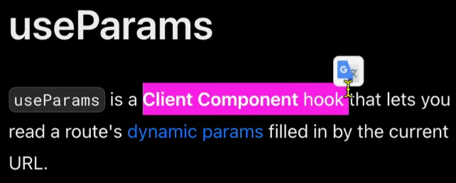
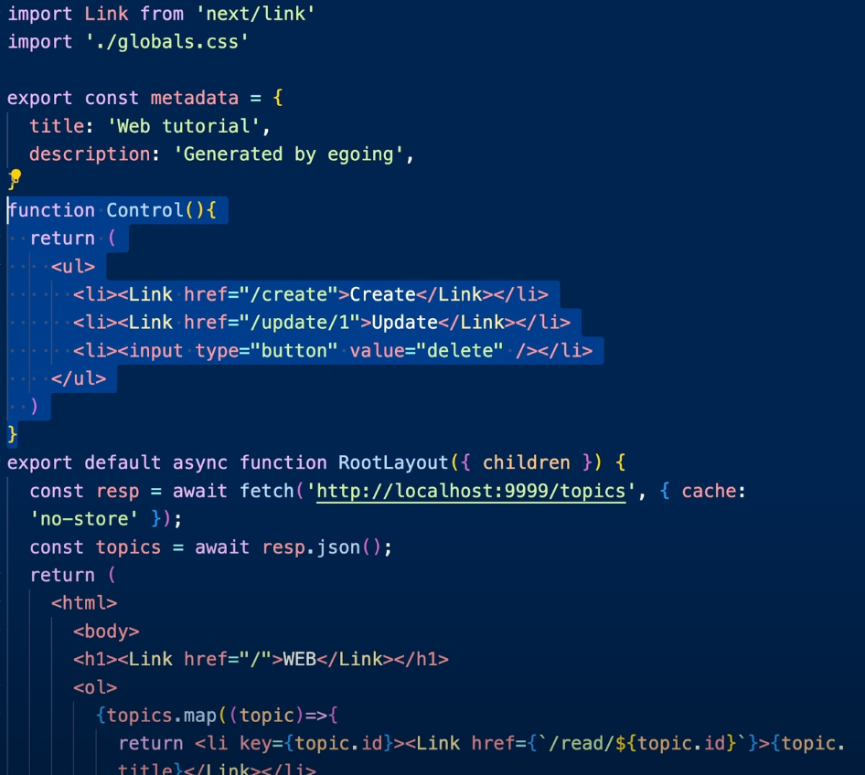
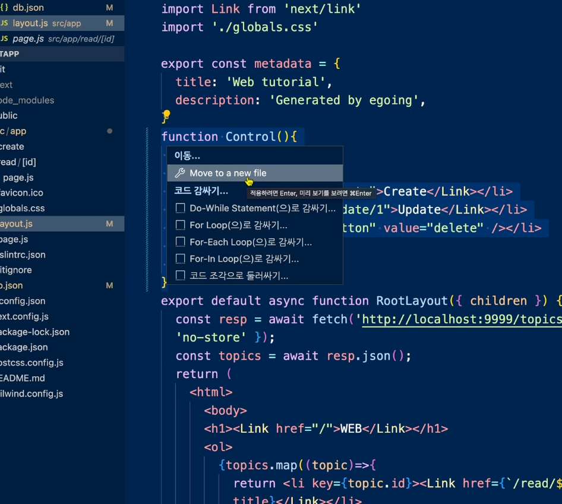
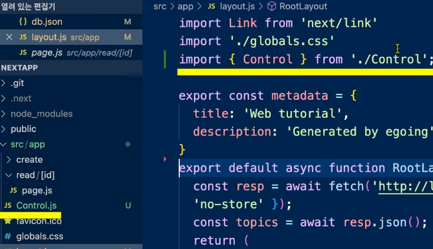

# Update & Delete

글을 선택했을 때만 update, delete 기능이 표시되도록 개선을 해보자.
이 과정에서 server component에서 client component로 부분적으로 전환하는 방법을 익히게 될 것.

### 절차

server component 내에서는 현재 동적 라우팅의 값([id])을 layout 안에서는 알 수 없다.

`useParams`를 사용해야 하는데 `useParams`는 client component에서 사용가능하다.

app/layout.js 전체를 client component로 전환해도 되지만, server component의 이점을 포기하기는 싫기 때문에 여기서는 client component의 기능이 필요한 부분만 별도의 컴포넌트로 분리하는게 좋아보인다.


이런식으로 create , update 부분만 따로 컴포넌트로 나누어 만들어보면
파일안에 특정함수만 다른타입의 컴포넌트로 바꿀 수 없기 때문에 별도에 파일로 쪼개보자.

> 
> 전구를 클릭한 후 `move to a new file`을 누르면
> Control.js 파일로 새로운 파일로 빠져나오게 된다.


이제 Control.js 만 클라이언트 컴포넌트로 만들어 useParam을 써서 페이지 아이디를 알아내고 아이디값이 있다면 update, delete 표시가 나오게 만들면 된다.

```js
{
  id ? (
    <>
      <li>
        <Link href={"/update/" + id}>Update</Link>
      </li>
      <li>
        <input type="button" value="delete" />
      </li>
    </>
  ) : null;
}
```

다음에 해결해야할 사항: update 값을 클릭했을때 우리가 가지고 있는 url 값으로 이동해야하기 때문에 링크 태그 수정해주면 끝~
