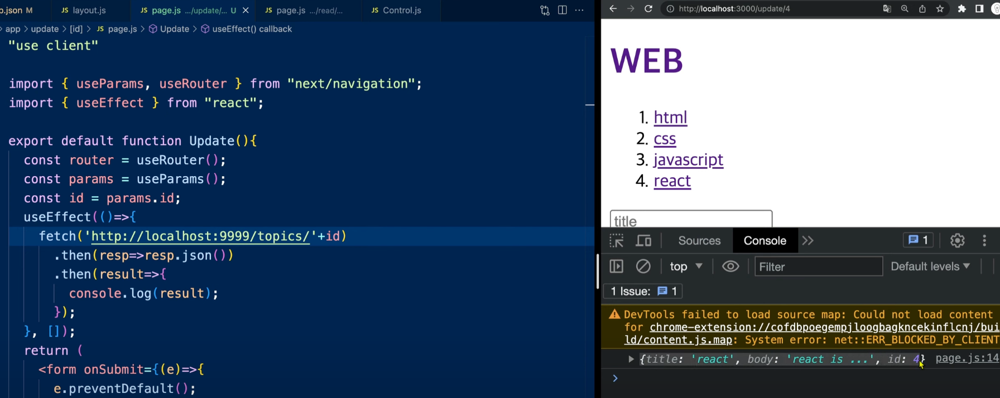
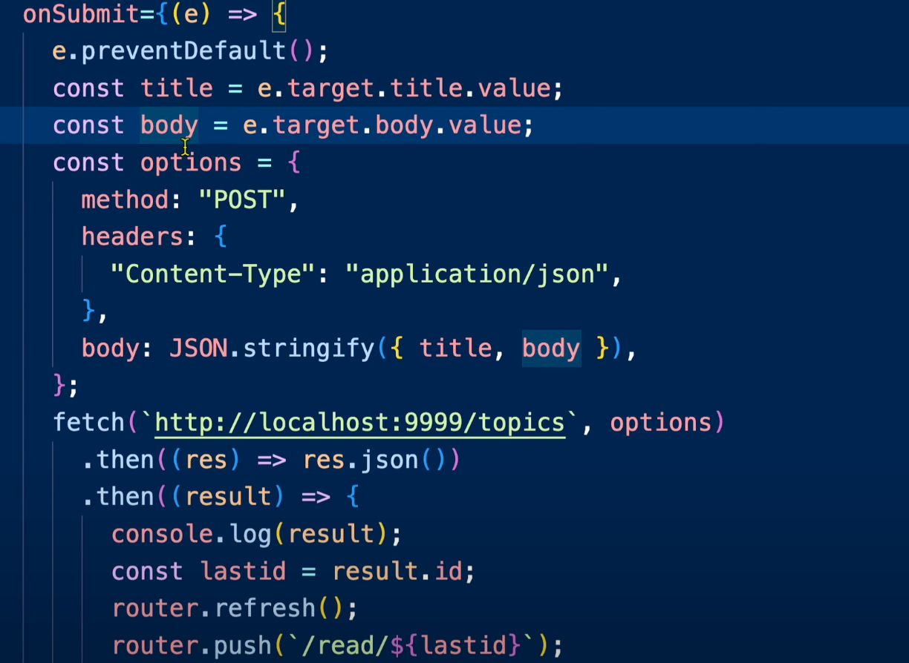
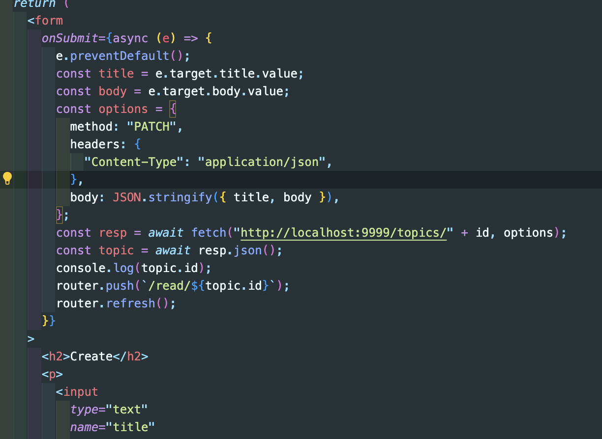

# 글 수정

수정 기능은 크게 두가지 기능을 합친 것이다. (read + create)
기본적인 UI는 Create를 가져오는 것이 편하기 때문에 그대로 가져왔다.
하지만 현재 Read 페이지는 SSR 페이지이고 Create는 CSR 페이지이다.
이것들을 그대로 사용할 수 없다. 어떻게 바꿔줘야할까?

### 절차

useEffect를 활용해서 데이터 fetch를 받아온다.
useParams 을 통해서 update할 대상에 아이디값도 받아와서 그 아이디로 read 기능을 작동


이제 밑에 있는 title과 body부분에 해당하는 내용을 적용시키기 위해서 useState를 사용해준다.

```js
const [title, setTitle] = useState(``);
const [body, setBody] = useState(``);
const router = useRouter();
const params = useParams();
const id = params.id;

useEffect(() => {
  fetch("http://localhost:9999/topics/" + id)
    .then((resp) => resp.json())
    .then((result) => {
      setTitle(result.title);
      setBody(result.body);
    });
});
```

이제 input에 title, body state를 적용시키면 -> 값이 입력이 되지만 값이 바뀌지 않는다.(value값이 바뀌지 않기 때문)
onChange 를 이용해서 값이 바뀔때마다 state를 수정시켰다.

```js
<p>
  <input
    type="text"
    name="title"
    placeholder="title"
    value={title}
    onChange={(e) => setTitle(e.target.value)}
  />
</p>
<p>
  <textarea
    name="body"
    placeholder="body"
    value={body}
    onChange={(e) => setBody(e.target.value)}
  ></textarea>
</p>
```




서버쪽으로 메세지를 보낼 때 method 는 수정이기 때문에 PUT 이나 PATCH 로 바꿔주고,
데이터를 전송하는데 전송하려는 주소도 id 값을 추가해서 수정

그리고 수정을 해보면 read 페이지도 캐쉬값이 저장되어져 있어서 글이 그대로 일 것이다. Read 부분도 cache:no-store 옵션 추가해주면 정상 작동되는 것을 확인가능.
