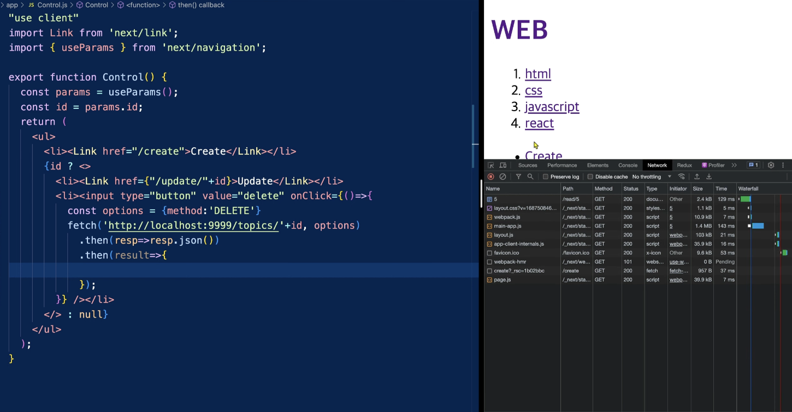
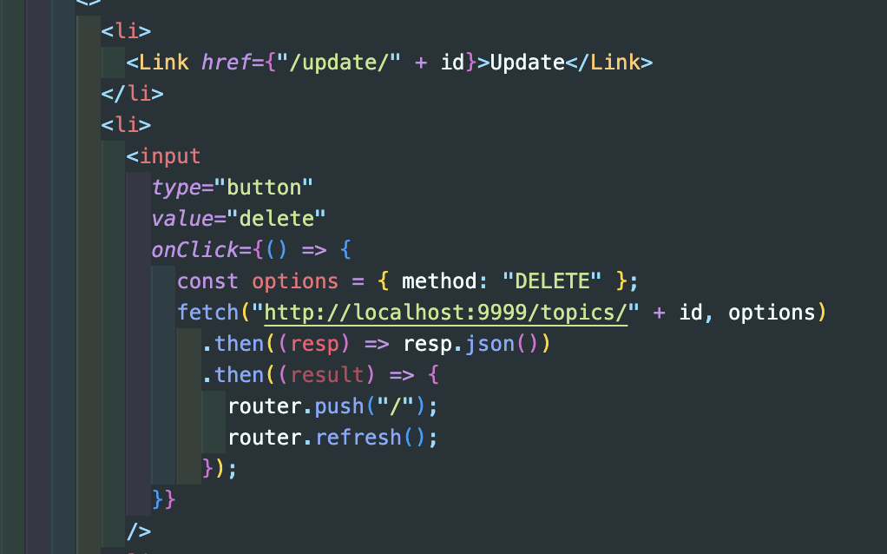

# 글 삭제

delete 버튼을 누르면 삭제가 되게 만들어보자.
`Control.js`에서 onClick 이벤트를 만들고 Method도 delete로 보내서
NetWork 탭에서 삭제가 된걸 확인하자.

삭제를 하게 되면 열고 있는 데이터가 사라진 것이기에 `/` 로 리디렉션을 해야한다.
router 를 통해 작업을 해주고 서브컴포넌트들을 refresh를 해야하니 리프레쉬도 해주게 되면 루트로 이동하고 삭제가 된 것을 확인 할 수 있다.
