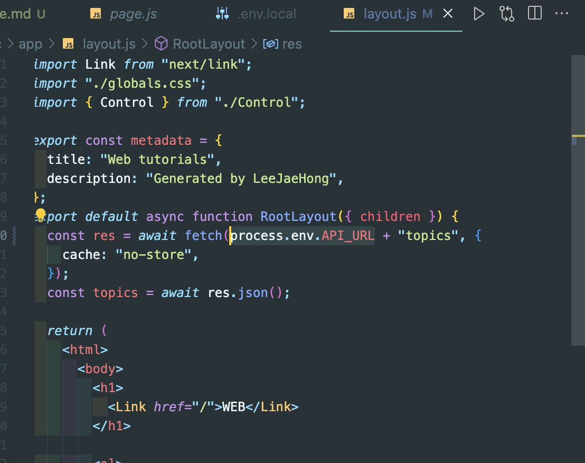
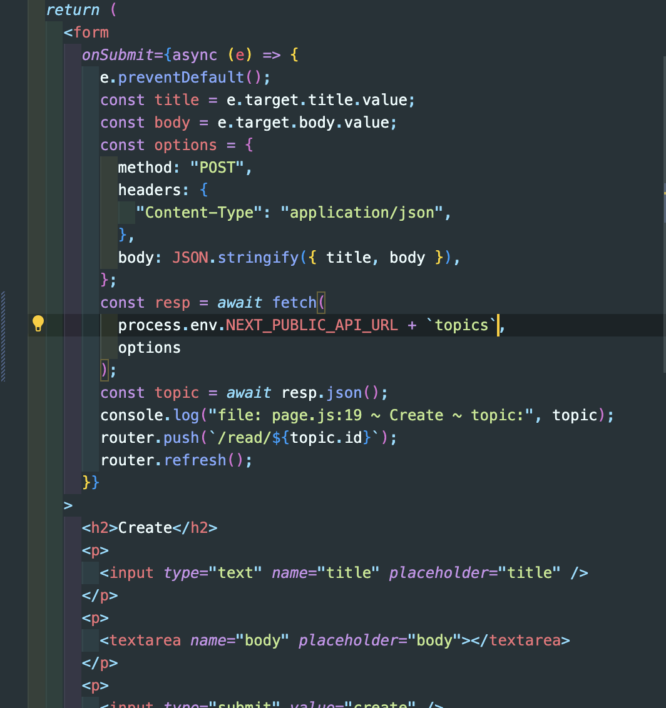
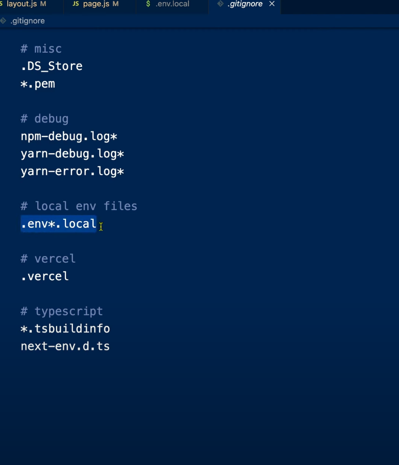

# 환경변수 & 졸업

코드에 포함시킬 수 없는 정보는 환경변수의 형태로 관리하는 것이 좋다.
예를들어, 서버의 주소가 코드 안에 포함되어 있다.

```js
// Ex
const resp = await fetch(`http://localhost:9999/topics/${id}`);
```

주소가 `localhost`로 하드코딩 되어있는데 개발할 때 사용하는 API 주소와 실서버 주소와 다를 경우가 존재한다.
이런 정보를 어플리케이션 소스코드에서 떨어뜨려서 별도로 관리하는 필요성이 있다.
그때는 환경변수를 살펴보면 된다.

> 실서버와 개발서버의 주소가 다르면 문제가 생긴다.

.env.local 이라는 파일을 홈디렉토리에 만들고 어플리케이션에서 사용하는 정보를 적어주면된다.

## 사용법

1. `.env.local` 파일 생성

> 서버가 꺼졌다가 다시 켜질 수 있다 -> nextjs가 env.local을 확인하는 과정이다.

```js
// env
API_URL=http://localhost:9999/
```

환경변수는 process.env.변수명을 이용해서 가져올 수 있다.
예를들면 아래와 같다.

```js
const resp = await fetch(`${process.env.API_URL}topics/${id}`);
```

이걸 활용해서 Read 페이지 fetch를 바꿔보자

페이지를 확인해보면 글 리스트가 잘 나오는걸 확인할 수 있다.
하지만 Create 기능부분에서도 똑같이 바꾸면 오류가 뜬다.

Create 페이지에서 console.log를 찍어보면 env가 undefined로 찍히는 걸 볼 수 있다.

### 왜?

기본적으로 환경변수에는 `DB_PASSWORD`와 같이 기밀이 중요한 데이터가 포함될 가능성이 높은데
이런 비밀정보까지 클라이언트 컴포넌트에 노출이 된다면 브라우저로 전송이 될 것이고 이 말은 정보유출을 뜻한다.
이런 경우를 막기위해 서버컴포넌트에서만 접속이 가능하다.

### 웹브라우저를 위한 환경변수를 쓰고 싶다면?

`NEXT_PUBLIC_` 접두사가 없으면 server component에서만 사용할 수 있고, client component에서는 사용할 수 없다.
이는 `DB_PASSWORD`와 같은 비밀정보를 보호하기 위한 안전장치


`NEXT_PUBLIC_`을 추가 후 리로드 해보면 Create 기능이 잘 작동하는 것을 확인할 수 있을 것이다.
`API_URL`이라는 환경변수가 `NEXT_PUBLIC_` 덕분에 웹브라우저로 전송될 수 있었기 때문이다.

이제 read, update, create, delete 기능을 하는 api 부분을 환경변수로 바꿔주면 끝.

### 버전관리할때는 환경변수를 어떻게 관리해야할까?

**비추**

`.gitignore` 파일을 보면 "이런 파일들은 버전관리 하지말아주세요" 라고 권고한 내용들이 적혀있을 것이다.
`.env` 파일은 그 중에 하나일 것이다.
하지만 개발을 하다보면 `.env.local` 에 기본형식을 알아야 그것을 보고 `.env.local`을 만들 것이다. 그렇기 때문에 `.env.local.example` 을 만들어 sample 정보를 만들어두면 다른사람이 파일을 받아서 사용할때 `.env.local.example` 파일을 보고 `.env.local`을 만들고 개발환경을 구축할 수 있을 것이다.
